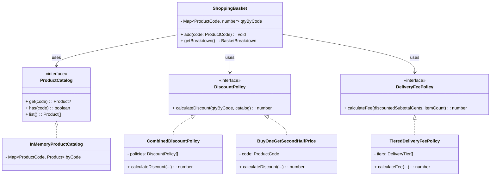
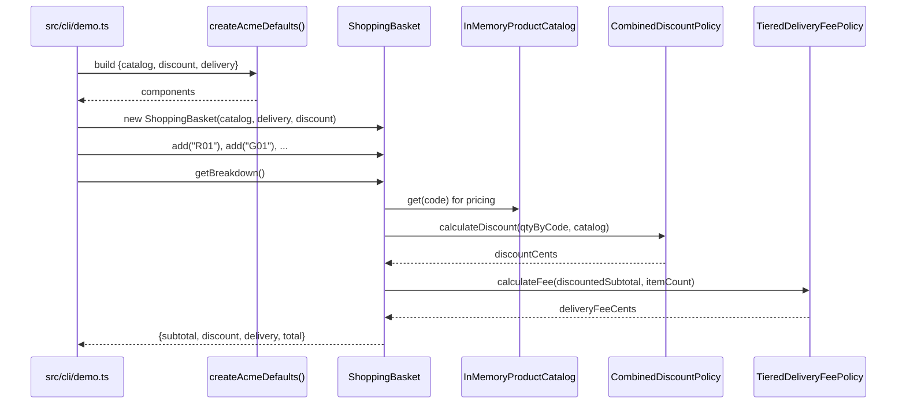

<div align="center">

# 🧺 Acme Widget Basket

**TypeScript · Dependency Injection · Strategy Pattern · Tests · Validations**

[](https://www.typescriptlang.org/)


<sup>No HTTP. No UI. A tiny, readable pricing engine + a small CLI.</sup>

</div>

---

## 🚀 Quick Start

```bash
npm i
npm test
npm start -- R01 R01     # → $54.37
# CLI entry: src/cli/demo.ts ("start": "tsx src/cli/demo.ts")
```

### 📜 Requirements (from the brief)

- **Products**: R01 $32.95, G01 $24.95, B01 $7.95
- **Delivery** (by discounted subtotal): < $50 → $4.95, < $90 → $2.95, ≥ $90 → free
- **Offer**: Buy one R01, second R01 half price (per pair, rounded)
- **Basket API**: initialize with catalog + rules; add(code), total()

### Expected totals:

- `B01,G01` → **$37.85**
- `R01,R01` → **$54.37**
- `R01,G01` → **$60.85**
- `B01,B01,R01,R01,R01` → **$98.27**

---

## 🧩 What It Does

1. **Add products by code**: R01, G01, B01
2. **Apply offer**: buy one red (R01), second red half price
3. **Apply delivery tiers** on discounted subtotal
4. **Return final total** (money-safe via cents)

---

## 🖥️ CLI Usage

```bash
npm start -- B01 G01                     # $37.85
npm start -- R01 R01                     # $54.37
npm start -- R01 G01                     # $60.85
npm start -- B01 B01 R01 R01 R01         # $98.27
```

---

## 📦 Library Usage

```typescript
import { ShoppingBasket, createAcmeDefaults, formatUsd } from "./src";

const { catalog, deliveryPolicy, discountPolicy } = createAcmeDefaults();
const basket = new ShoppingBasket(catalog, deliveryPolicy, discountPolicy);

basket.add("B01");
basket.add("G01");

console.log(formatUsd(basket.getBreakdown().grandTotalCents)); // $37.85
```

---

## 🗂️ Folder Map

```
src/
  config/acme.ts                # USD config (products, delivery tiers, offers)
  acme/wiring.ts                # Build catalog + policies from config (DI)
  basket/shoppingBasket.ts      # subtotal → discount → delivery → total
  catalog/inMemoryCatalog.ts    # product lookup + validations
  domain/types.ts               # small, accurate interfaces
  policies/
    discounts/
      buyOneGetSecondHalf.ts    # offer strategy (R01 second half)
      combinedDiscount.ts       # compose multiple discounts
    delivery/tieredDelivery.ts  # delivery strategy (tiers)
  utils/{assert,money}.ts       # runtime guards + cents helpers
  cli/demo.ts                   # CLI entry
  index.ts                      # public API barrel (nice imports)
tests/
  basket.examples.spec.ts       # 4 sample baskets
  validation.spec.ts            # negative/edge cases
eslint.config.js                # ESLint v9 flat config (Node globals)
.github/workflows/ci.yml        # CI: lint/format/typecheck/tests
```

---

## 🧠 Architecture (1-Minute Tour)

**Dependency Injection**: `ShoppingBasket(catalog, deliveryPolicy, discountPolicy)`

**Strategies**:

- `DiscountPolicy` → `BuyOneGetSecondHalfPrice("R01")` (composable via `CombinedDiscountPolicy`)
- `DeliveryFeePolicy` → `TieredDeliveryFeePolicy`

**Config-Driven**: human-readable USD config → converted to cents at wiring

**Separation**: catalog / discounts / delivery / basket orchestrator

---

## 🧾 Domain Model

```typescript
ProductCode = "R01" | "G01" | "B01"

Product { code, name, unitPriceCents }

ProductCatalog { get, has, list }

DiscountPolicy { calculateDiscount(qtyByCode, catalog) }

DeliveryFeePolicy { calculateFee(discountedSubtotalCents, itemCount) }

BasketBreakdown { itemSubtotalCents, discountCents, deliveryFeeCents, grandTotalCents }
```

---

## ⚙️ Configuration

**src/config/acme.ts** (USD):

- `ACME_PRODUCTS_USD`
- `ACME_DELIVERY_RULES_USD` (final bound uses `Infinity`)
- `ACME_OFFERS` (e.g., `redBogoHalfCode: "R01"`)

**src/acme/wiring.ts** maps USD → cents and composes catalog + policies.

---

## 💸 Pricing Rules

### Products

| Code    | Name         | Price  |
| ------- | ------------ | ------ |
| **R01** | Red Widget   | $32.95 |
| **G01** | Green Widget | $24.95 |
| **B01** | Blue Widget  | $7.95  |

### Delivery (by discounted subtotal)

| Subtotal | Delivery |
| -------- | -------- |
| < $50    | $4.95    |
| < $90    | $2.95    |
| ≥ $90    | $0.00    |

### Offer

Buy one R01, get the second R01 half price (per pair; discount = pairs × round(price/2)).

---

## 🧮 Algorithm (How Totals Are Computed)

1. **Subtotal**: sum qty × unitPriceCents for each product.
2. **Discount**: ask DiscountPolicy (R01 pairs → half off second, rounded).
3. **Discounted subtotal**: subtotal − discount (clamped ≥ 0).
4. **Delivery**: ask DeliveryFeePolicy using discounted subtotal + item count.
5. **Total**: discountedSubtotal + deliveryFee.

---

## 💵 Money Handling

- All math in **cents** (integers) → no float drift
- `toCents(32.95)` → `3295`, `formatUsd(3295)` → `"$32.95"`
- Half price uses **nearest-cent rounding** (matches $54.37 example)

---

## ✅ Validations

- **Catalog**: unique codes, non-empty names, price ≥ 0
- **Delivery tiers**: strictly increasing bounds; last bound `Infinity`; fee ≥ 0
- **Offer target**: must exist in catalog when applied
- **Basket.add**: unknown code → throws
- **Money input**: `\d+(\.\d{1,2})?`

---

## 🧪 Tests

```bash
npm test
```

**Covers**:

- All four example baskets
- Empty basket (no delivery)
- Invalid code
- Bad configs (duplicate product codes, bad tiers, invalid money)

---

## 🧰 Dev Tooling

```bash
npm run lint          # ESLint v9 (flat config)
npm run lint:fix
npm run format
npm run format:check
npm run typecheck
```

**CI** (`.github/workflows/ci.yml`) runs lint → format check → typecheck → tests on push/PR.

---

## 📊 Worked Examples

### R01, R01

`32.95 + 32.95 = 65.90` → discount `round(32.95/2)=16.48` → `49.42 + delivery 4.95` → **$54.37**

### B01, G01

`7.95 + 24.95 = 32.90` → discount `0` → delivery `4.95` → **$37.85**

### R01, G01

`32.95 + 24.95 = 57.90` → discount `0` → delivery `2.95` → **$60.85**

### B01, B01, R01, R01, R01

`2×7.95 + 3×32.95 = 114.75` → discount `16.48` → `98.27 + delivery 0` → **$98.27**

---

## 🧭 Diagrams

### Architecture (DI + Strategies)



### Sequence (CLI → Total)



---

## 🔧 Troubleshooting

- **ESLint v9 errors**: ensure `eslint.config.js` (flat config) exists; don't use `.eslintrc`
- **Infinity tier assertion**: last delivery tier must be `Number.POSITIVE_INFINITY`
- **Unknown product code**: codes are case-sensitive (`R01`, `G01`, `B01`)

---

## 📌 Assumptions

- Delivery fee applies **after** discounts
- Empty basket → **no delivery fee**
- Single currency (**USD**)
- Offer rounding uses **nearest cent**

---

## 📝 Conventional Commits (suggested)

```
feat(basket): add ShoppingBasket orchestration
feat(discounts): implement R01 second-half offer
feat(delivery): add tiered delivery strategy
refactor(wiring): move constants to config
test: add example + validation specs
chore(eslint): flat config + rules
docs: add diagrams + README
```

---

## 📄 License

**MIT** — use it freely; attribution appreciated.
